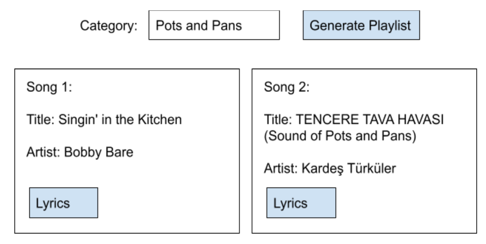

# MusixMatch Smart Playlist
Generate a "smart" playlist that is based off of the product category that an advertiser sells in.

The goal is to build an API that is able to serve data for the following view:

## API Requirements
### /category
returns 2 songs immediately, including title, artist and lyrics and next songs in subsequent requests

## Generating playlist
Have each song after the first be as similar as possible in lyrics to the song before using MusixMatchAPI.

First song: track.search to fetch the first song using the q_lyrics query parameter.
Subsequent Songs:  take 5 random words from the lyrics of the previous song and combine to use as new q_lyrics.
No song should ever repeat in a playlist

